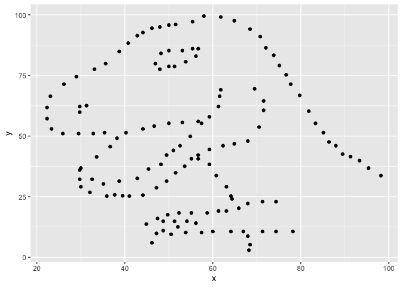

Lab 01 - Hello R
================
Ye Dam Yi
2/1/2021

## Load packages and data

``` r
library(tidyverse) 
library(datasauRus)
```

## Exercises

### Exercise 1

In the dataframe datasaurus\_dozen are 1846 rows and 3 columns. The
variables included are dataset, x, and y.

### Exercise 2

First let’s plot the data in the dino dataset:

``` r
dino_data <- datasaurus_dozen %>%
  filter(dataset == "dino")

library("ggplot2")

ggplot(data = dino_data, mapping = aes(x = x, y = y)) +
  geom_point()
```

<!-- -->

And next calculate the correlation between `x` and `y` in this dataset:

``` r
dino_data %>%
  summarize(r = cor(x, y))
```

    ## # A tibble: 1 x 1
    ##         r
    ##     <dbl>
    ## 1 -0.0645

The correlation coefficient is -.06447.

### Exercise 3

``` r
star_data <- datasaurus_dozen %>%
  filter(dataset == "star")

ggplot(data = star_data, mapping = aes(x = x, y = y)) + geom_point()
```

<!-- -->

``` r
star_data %>%
  summarize(r = cor(x, y))
```

    ## # A tibble: 1 x 1
    ##         r
    ##     <dbl>
    ## 1 -0.0630

The value of the correlation coefficient is not that different from the
one for the dino dataset.

### Exercise 4

``` r
circle_data <- datasaurus_dozen %>%
  filter(dataset == "circle")

ggplot(data = circle_data, mapping = aes(x = x, y = y)) + geom_point()
```

<!-- -->

``` r
circle_data %>%
  summarize(r = cor(x, y))
```

    ## # A tibble: 1 x 1
    ##         r
    ##     <dbl>
    ## 1 -0.0683

The correlation coefficient is close to the one found for the dino
dataset.

### Exercise 5

Add code and narrative as needed. To add R chunks either type out the
backticks, curly braces, and the letter `r` or use the Insert chunk
button above, green C+.
