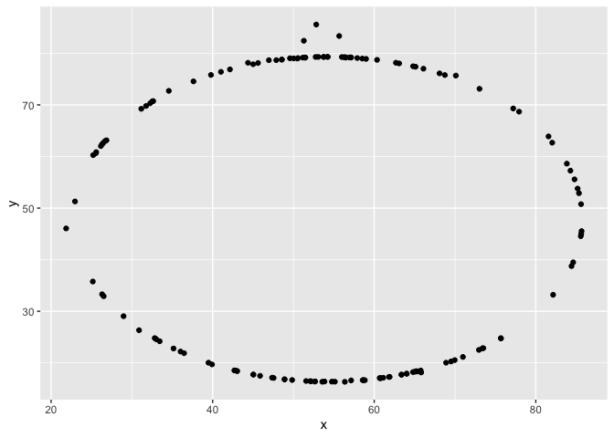

Lab 01 - Hello R
================
Ye Dam Yi
2/1/2021

## Load packages and data

``` r
library(tidyverse) 
library(datasauRus)
```

## Exercises

### Exercise 1

In the dataframe datasaurus\_dozen are 1846 rows and 3 columns. The
variables included are dataset, x, and y.

### Exercise 2

First let’s plot the data in the dino dataset:

``` r
dino_data <- datasaurus_dozen %>%
  filter(dataset == "dino")

library("ggplot2")

ggplot(data = dino_data, mapping = aes(x = x, y = y)) +
  geom_point()
```

<!-- -->

And next calculate the correlation between `x` and `y` in this dataset:

``` r
dino_data %>%
  summarize(r = cor(x, y))
```

    ## # A tibble: 1 x 1
    ##         r
    ##     <dbl>
    ## 1 -0.0645

The correlation coefficient is -.06447.

### Exercise 3

``` r
star_data <- datasaurus_dozen %>%
  filter(dataset == "star")

ggplot(data = star_data, mapping = aes(x = x, y = y)) + geom_point()
```

<!-- -->

``` r
star_data %>%
  summarize(r = cor(x, y))
```

    ## # A tibble: 1 x 1
    ##         r
    ##     <dbl>
    ## 1 -0.0630

The value of the correlation coefficient is not that different from the
one for the dino dataset.

### Exercise 4

``` r
circle_data <- datasaurus_dozen %>%
  filter(dataset == "circle")

ggplot(data = circle_data, mapping = aes(x = x, y = y)) + geom_point()
```

<!-- -->

``` r
circle_data %>%
  summarize(r = cor(x, y))
```

    ## # A tibble: 1 x 1
    ##         r
    ##     <dbl>
    ## 1 -0.0683

The correlation coefficient is close to the one found for the dino
dataset.

### Exercise 5

``` r
ggplot(datasaurus_dozen, aes(x = x, y = y, color = dataset))+
  geom_point()+
  facet_wrap(~ dataset, ncol = 3) +
  theme(legend.position = "none")
```

<!-- -->

``` r
datasaurus_dozen %>%
  group_by(dataset) %>%
  summarize(r = cor(x, y)) %>%
  print(13)
```

    ## # A tibble: 13 x 2
    ##    dataset          r
    ##  * <chr>        <dbl>
    ##  1 away       -0.0641
    ##  2 bullseye   -0.0686
    ##  3 circle     -0.0683
    ##  4 dino       -0.0645
    ##  5 dots       -0.0603
    ##  6 h_lines    -0.0617
    ##  7 high_lines -0.0685
    ##  8 slant_down -0.0690
    ##  9 slant_up   -0.0686
    ## 10 star       -0.0630
    ## 11 v_lines    -0.0694
    ## 12 wide_lines -0.0666
    ## 13 x_shape    -0.0656
